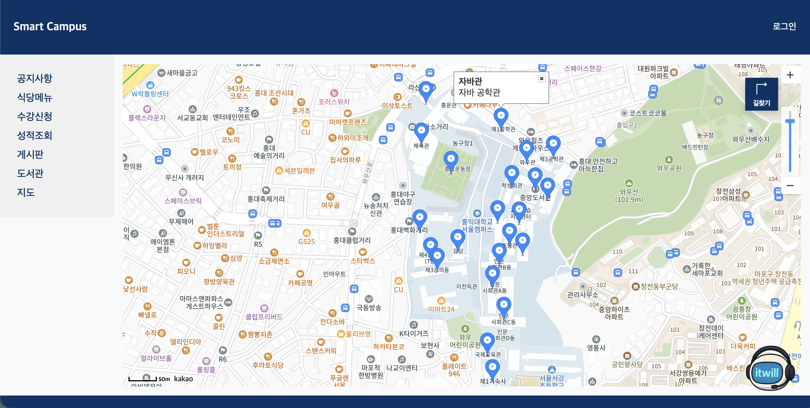
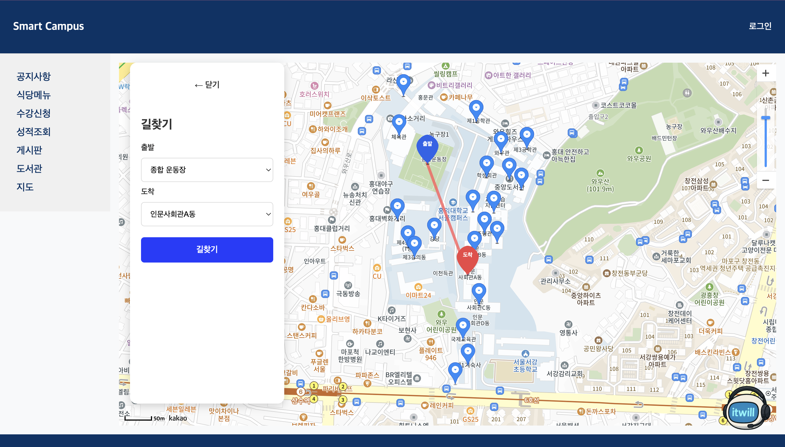

# Smart Campus

React, Spring Boot, Oracle DB를 기반으로 구현한 캠퍼스 웹서비스 팀 프로젝트입니다.  
학생들이 캠퍼스 생활 중 필요한 정보를 보다 편리하게 확인하고,  
교내 공간을 효율적으로 이용할 수 있도록 기획했습니다.

---

## 1. 프로젝트 개요

- **프로젝트명**: Smart Campus
- **진행 형태**: 팀 프로젝트
- **개발 기간**: 2025.06.27 ~ 2025.07.22
- **참여 인원**: 11명
- **주제**: 캠퍼스 웹서비스
- **기술 스택**: React, Spring Boot, Oracle DB, Kakao Map API
- **주요 기능**: 캠퍼스 지도, 건물 마커 표시, 경로 확인 기능

Smart Campus는 캠퍼스 생활에 필요한 기능을 제공하는 웹서비스를 구현한 팀 프로젝트입니다.  
학생들이 교내 주요 공간과 정보를 보다 직관적으로 확인하고,  
필요한 기능을 쉽게 이용할 수 있도록 구성했습니다.

프로젝트를 진행하며 사용자 흐름을 고려한 화면 구성과 기능 연결 방식을 고민했고,  
프론트엔드와 백엔드를 연동해 서비스의 기본 구조를 구현했습니다.  
또한 프로젝트 목적에 맞게 UI와 기능 방식을 조정하며  
사용 편의성을 높이는 방향으로 개선했습니다.

---

## 2. 담당 역할

프로젝트에서 아래 기능 구현과 개선에 참여했습니다.

- **지도 화면 구현**
  - 카카오맵 SDK를 활용한 캠퍼스 지도 렌더링
  - 지도 중심 좌표 설정 및 기본 화면 구성

- **건물 데이터 표시**
  - 백엔드 API와 연동하여 건물 데이터를 불러오고 지도에 마커로 표시
  - 건물 클릭 시 정보창이 나타나도록 구현

- **경로 확인 기능 구현**
  - 출발지와 도착지 선택 기반의 경로 확인 기능 구성
  - 경로 표시 방식과 사용자 흐름을 프로젝트 목적에 맞게 조정

- **UI 개선**
  - 서비스 흐름을 고려해 화면 내 기능 사용 방식을 정리
  - 사용자가 주요 기능을 보다 직관적으로 확인할 수 있도록 개선

이 과정을 통해 지도 기반 화면 구성, 데이터 연동,  
그리고 프로젝트 목적에 맞는 기능 설계의 중요성을 경험할 수 있었습니다.

---

## 3. 기술 스택

### Frontend
- React
- JavaScript
- HTML
- CSS

### Backend
- Spring Boot
- Java
- Gradle

### Database
- Oracle DB

### API / Library
- Kakao Map API
- Axios

---

## 4. 프로젝트 구조

    Smart-Campus
    ├── frontend-Smart-Campus
    └── backend-Smart-Campus

- `frontend-Smart-Campus`  
  React 기반 프론트엔드 프로젝트입니다.  
  지도 화면, 건물 정보 표시, 경로 확인 UI를 담당합니다.

- `backend-Smart-Campus`  
  Spring Boot 기반 백엔드 프로젝트입니다.  
  건물 데이터 조회 및 관련 API를 담당합니다.

---

## 5. 주요 기능

### 1) Main Page
서비스의 첫 화면으로, 전체 분위기와 기본 이용 흐름을 보여주도록 구성했습니다.  
지도 화면을 중심으로 주요 기능이 자연스럽게 이어질 수 있도록 구현했습니다.

### 2) Campus Map
카카오맵 SDK를 활용해 캠퍼스 지도를 렌더링했고,  
사용자가 교내 주요 공간을 직관적으로 확인할 수 있도록 구성했습니다.

### 3) Building Marker
백엔드에서 받아온 건물 데이터를 지도에 마커로 표시했고,  
건물 클릭 시 이름과 설명을 확인할 수 있도록 정보창을 구현했습니다.

### 4) Route Finding
출발지와 도착지를 선택하면 두 위치의 경로를 시각적으로 확인할 수 있도록 구성했습니다.  
현재는 각 좌표를 기준으로 두 지점을 직선 형태로 연결해 표시하도록 구현했습니다.

---

## 6. Trouble Shooting

### 길찾기 기능 구현 방식 조정

길찾기 기능을 구현하는 과정에서 외부 길찾기 방식을 활용하는 방향도 검토했지만,  
이번 프로젝트에서는 캠퍼스 내 이동 흐름을 직관적으로 보여주는 데 중점을 두었습니다.

이에 따라 출발지와 도착지 좌표를 기준으로  
두 지점을 직선 형태로 연결해 경로를 표시하는 방식으로 구현했습니다.  
이를 통해 프로젝트 목적과 구현 범위에 맞게 기능 방식을 조정하고,  
사용자가 핵심 흐름을 쉽게 이해할 수 있도록 구성했습니다.

---

## 7. 실행 전 참고 사항

이 프로젝트는 프론트엔드에서 카카오맵 기능을 사용하기 위해 환경 변수 설정이 필요합니다.  
보안상 실제 API 키는 저장소에 포함하지 않았습니다.

`frontend-Smart-Campus` 폴더에 `.env` 파일을 생성한 뒤 아래 예시 형식으로 작성해야 합니다.

    REACT_APP_KAKAO_KEY=your_kakao_javascript_key
    REACT_APP_KAKAO_REST_KEY=your_kakao_rest_api_key

---

## 8. 주요 화면

## Main Page

## Campus Map

## Route Finding

---

## 9. 배운 점

이 프로젝트를 통해 지도 기반 서비스 화면 구성과 프론트엔드-백엔드 데이터 연동 과정을 경험할 수 있었습니다.  
또한 단순히 기능을 구현하는 것에 그치지 않고,  
프로젝트 목적에 맞게 기능 방식과 UI를 조정하는 과정의 중요성을 배울 수 있었습니다.

앞으로도 사용자에게 필요한 기능을 더 직관적이고 안정적으로 제공할 수 있는  
개발자로 성장하고자 합니다.

---

## 10. 참고 사항

- 본 저장소는 포트폴리오 정리를 위해 별도로 구성한 프로젝트 저장소입니다.
- 일부 예시 데이터 및 화면 구성은 포트폴리오 용도로 정리되었습니다.
- 민감한 정보 및 실제 API 키는 포함하지 않았습니다.

---

## 11. 작성자

- **이름**: 한우태
- **희망 분야**: Java 백엔드 개발
